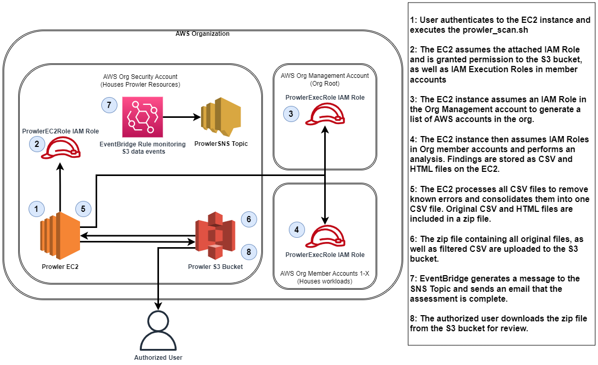

# Multi-Account Security Assessment via Prowler with Batching and Post Processing

Built to facilitate an AWS security assessment utilizing [Prowler](https://github.com/prowler-cloud/prowler), this solution utilizes bash scripting to provide flexibility for many use cases and AWS environments.

"Prowler is an Open Source security tool to perform AWS security best practices assessments, audits, incident response, continuous monitoring, hardening and forensics readiness. It contains more than 240 controls covering CIS, PCI-DSS, ISO27001, GDPR, HIPAA, FFIEC, SOC2, AWS FTR, ENS and custom security frameworks."

The objective is to provide a comprehensive solution which allows for low-effort deployment, optimized assessment speeds, and finding processing for report generation.

The entire solution is deployed through CloudFormation templates with tunable parameters at the time of deployment, as well as through the prowler_scan.sh script.

Once the environment is assessed, results are consolidated, expected error messages filtered out (e.g. Errors related to Control Tower S3 bucket restrictions preventing assessment), and findings packaged for use with an Excel report template to process into an easily readable form.

The processed output can be used as part of a report which highlights potential areas of improvement around security controls.

While there are many methods to deploy and utilize [Prowler](https://github.com/prowler-cloud/prowler) for an assessment, this solution has been designed to allow for a rapid deployment, full AWS Organization analysis, and finding processing as part of a security posture report.

CloudFormation templates and the bash script will be updated as new versions of [Prowler](https://github.com/prowler-cloud/prowler) are released, as well as as new common use cases warrant additional script functionality.

**Step by step deployment and usage is provided via the ProwlerAssessmentProcedure.md document.**

## **Technology stack**

Prowler / EC2 / S3 / SNS / IAM

## **Solution Architecture**

## **Related Resources**

- ProwlerAssessmentProcedure.md:  
    Step by step instructions for provisioning IAM Roles, Prowler Resources, and processing findings.

- Prowler-resources.yaml:  
    A CFT which is deployed in the account where the prowler EC2 instance will be deployed.  This template will deploy all necessary dependencies in order for prowler to perform assessments across all accounts. The IAM-ProwlerExecRole is dependent on this template being deployed first.  
    >Note: If this stack is deleted and redeployed, the ProwlerExecRole StackSet will need to be re-deployed to rebuild the cross-account dependency between IAM Roles.

- IAM-ProwlerExecRole.yaml:  
    A CFT to be deployed via StackSet across all member accounts (including the AWS Org Root/Management account). This will create an IAM Role which can be assumed by prowler during scanning.

- prowler-report-template.xlsm:  
    An excel document for processing of findings. Pivot tables allow for search capabilities, charts, and consolidated findings.
    >Note: The excel document version must match with a supported version of prowler.

- prowler_scan.sh:  
    Bash script used for assessing multiple AWS accounts in parallel. This script is automatically deployed onto the EC2 instance in the folder /usr/local/bin/prowler via the prowler-resources.yaml CFT in userdata. By default, this script assumes the IAM role “ProwlerExecRole” in the management account to generate a list of member accounts in the AWS Org. The script then uses this list of accounts to begin an assessment of the accounts. As the accounts are assessed, they will output results in the prowler/outputs directory in CSV and HTML formats.  Once all accounts have been assessed, the individual CSV files will be concatenated, duplicate lines removed, and all output files zipped. Note: This script has tunable variables within the script itself (See appendix for more details). This script is provided independently from the CFT for reference.

## **References**

Prowler Source: [https://github.com/prowler-cloud/prowler](https://github.com/prowler-cloud/prowler)

CIS Benchmarks: [https://d0.awsstatic.com/whitepapers/compliance/AWS\_CIS\_Foundations\_Benchmark.pdf](https://d0.awsstatic.com/whitepapers/compliance/AWS_CIS_Foundations_Benchmark.pdf)

## **Link to APG Pattern (Authorized Access Only)**

[https://apg-library.amazonaws.com/content/81ba9037-9958-4e4a-95b7-d68896075a5b](https://apg-library.amazonaws.com/content/81ba9037-9958-4e4a-95b7-d68896075a5b)
